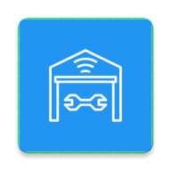

  


<br />
<div align="center">
  <a href="https://github.com/CPSG-26/qalbu">
    
  </a>

  <h3 align="center">Bengkelin</h3>

  <p align="center">
    Android application for Bangkit 2023 Capstone Project Team C23-PS474
    <br />
    <a href="https://github.com/rizfadh/bengkelin"><strong>Explore the docs »</strong></a>
    <br />
    <br />
    <a href="https://github.com/rizfadh/bengkelin">Report Bug</a>
    ·
    <a href="https://github.com/rizfadh/bengkelin">Request Feature</a>
  </p>
</div>


<!-- ABOUT THE PROJECT -->
## About The App

A mobile app that uses machine learning to detect tire quality, and book a nearby vehicle workshops. Our aim is to improve driving safety by raising awareness about tire condition, maintenance vehicles, and growing the SMEs Economic of the Vehicle Workshop. Most vehicle owners have less information about tire quality and struggle to find suitable spare parts and workshops. Our app will address these issues with a user friendly interface and comprehensive features.


### Built With

* [Android Studio](https://developer.android.com/studio)
* [Kotlin](https://kotlinlang.org/)
* [Navigation Component](https://developer.android.com/guide/navigation/)
* [Dagger Hilt](https://dagger.dev/hilt/)
* [Glide](https://bumptech.github.io/glide/)
* [Retrofit](https://square.github.io/retrofit/)
* [Preference DataStore](https://developer.android.com/topic/libraries/architecture/datastore)
* [Easy Permission](https://github.com/VMadalin/easypermissions-ktx)
* [Android Image Cropper](https://github.com/CanHub/Android-Image-Cropper)
* [Play Services Location](https://developers.google.com/android/guides/setup)
* [Shimmer](http://facebook.github.io/shimmer-android/)
* [SwipeRefreshLayout](https://developer.android.com/jetpack/androidx/releases/swiperefreshlayout)
* [OSRM API](https://project-osrm.org/)


<!-- GETTING STARTED -->
## Getting Started

### Prerequisites

To install and run Android Studio, your computer must meet these minimum requirements:

- 64-bit Microsoft® Windows® 8/10/11
- x86_64 CPU architecture; 2nd generation Intel Core or newer, or AMD CPU with support for a Windows Hypervisor
- 8 GB RAM or more
- 8 GB of available disk space minimum (IDE + Android SDK + Android Emulator)
- 1280 x 800 minimum screen resolution
- Git for Windows 2.x, with the Use Git from the Windows Command Prompt option.

If Git for Windows is already installed, make sure you can run git commands from the command prompt or PowerShell.


### Installation

1. Clone the repo
   ```sh
   git clone https://github.com/rizfadh/bengkelin.git
   ```
2. Build the Project
3. Connect your device or using the emulator Android Studio provided
4. Run 'app'
6. If you want to build the apk, follow this instruction
   ```sh
   Build > Build Bundle(s) / APK(s) > Build APK(s)
   ```
   
## Design
You can check our Wireframe, Mockup, and High-Fidelity Prototype from this link [Figma](https://www.figma.com/file/kxhAAI4UB8XH4EVt7LfdbP/Desain-Aplikasi?type=design&node-id=5%3A218&t=nN8GYxeO0GipqLzs-1)

## App Screenshot

| Login | Register | Home |
| ----------- | ----------- | -------- |
|  |  |  |

| Detail | Confirmation | Booking Success |
| ----------- | ----------- | -------- |
|  |  |  |

| Cropping Image | Analysis | Analysis Result |
| ----------- | ----------- | -------- |
|  |  |  |
